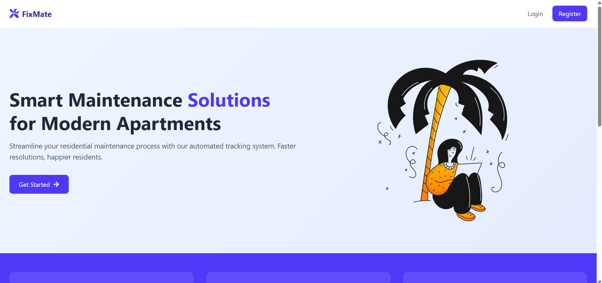
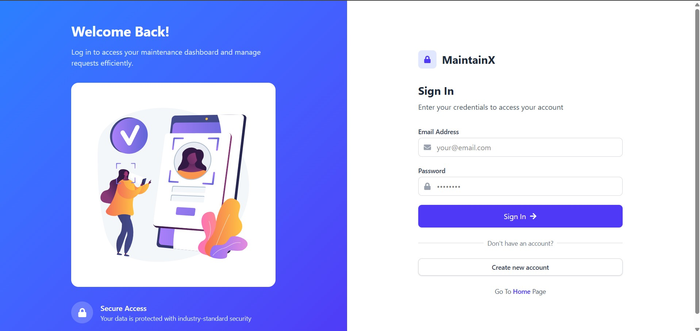
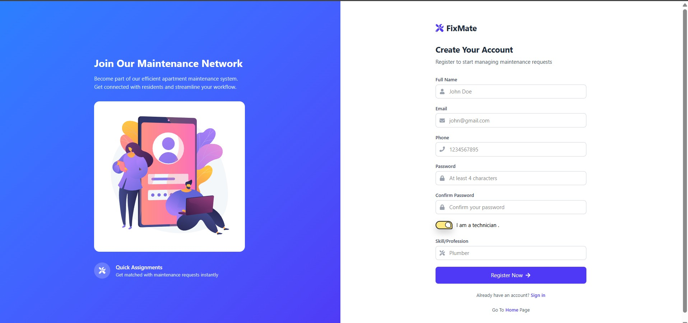
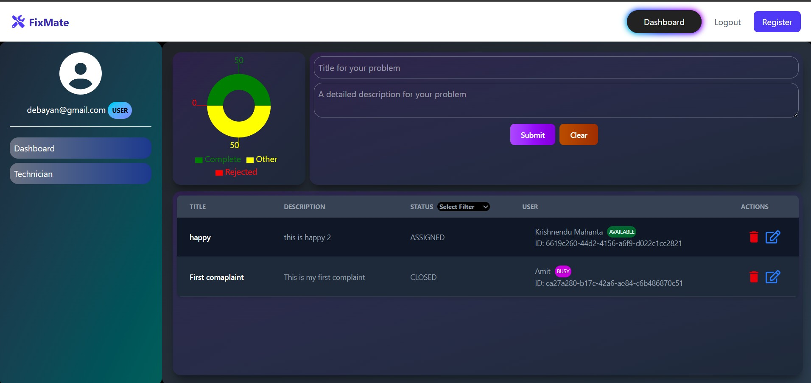
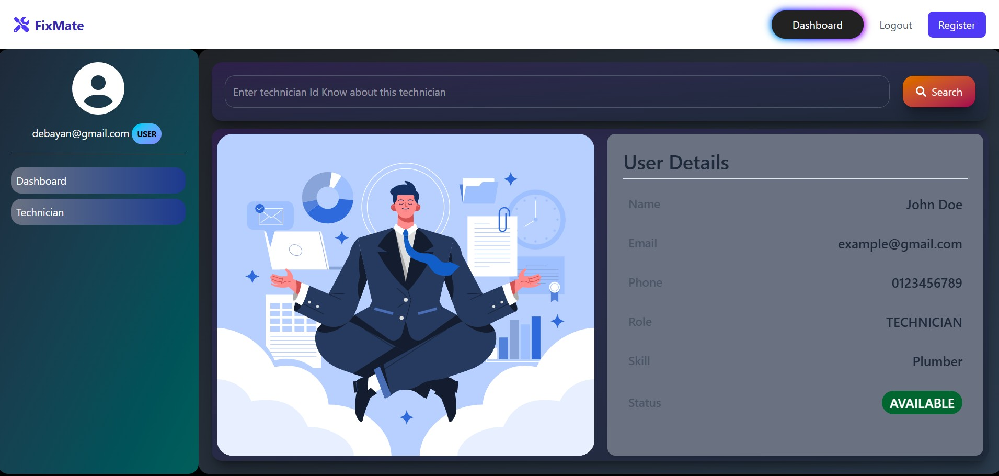
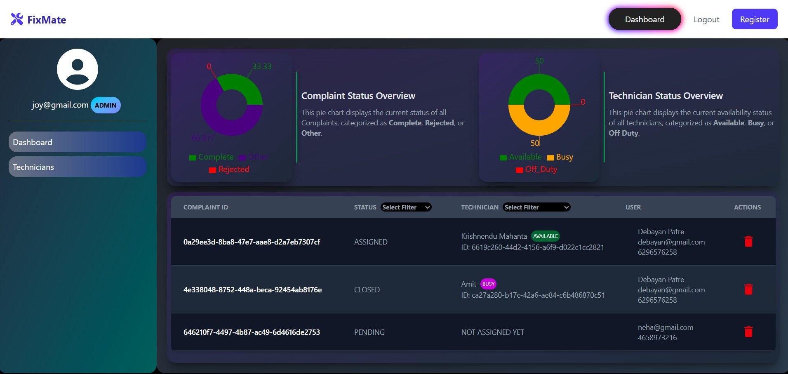
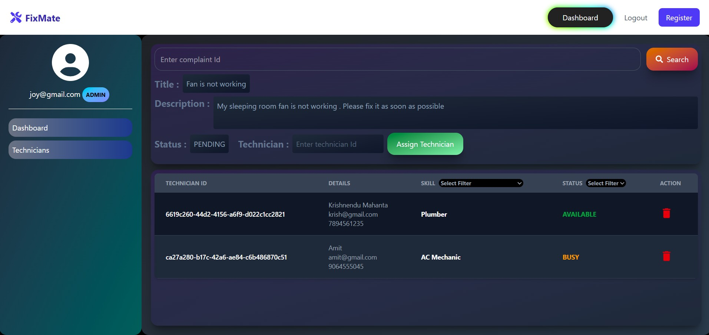
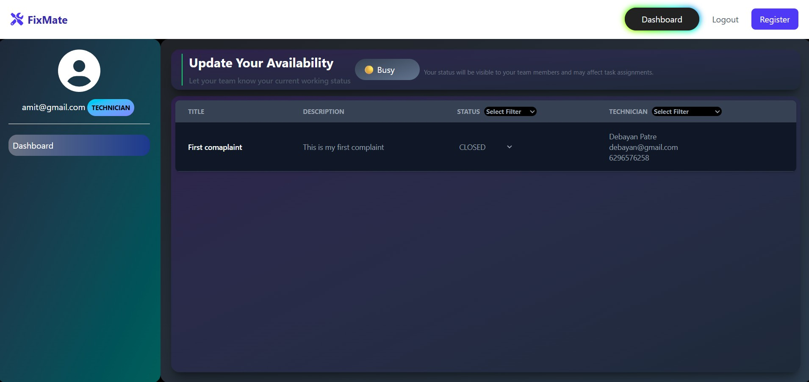

# 🏠 FixMate – Maintenance Request System for Apartments

FixMate is a full-stack web application built to streamline maintenance requests in residential societies. It enables residents to raise complaints, admins to assign technicians, and technicians to update complaint status through dedicated dashboards.

---

## 📌 Features

### 👤 Resident Dashboard
- Register/Login securely
- Raise new complaints (e.g., plumbing, electrical issues)
- Track status of each complaint in real-time

### 🛠️ Technician Dashboard
- Login and view assigned complaints
- Update complaint status (In Progress, Resolved)

### 👨‍💼 Admin Dashboard
- View all complaints in the system
- Assign technicians based on complaint type
- Generate statistics and reports
- View pie charts for complaint status distribution

---

## 🧑‍💻 Technologies Used

| Backend             | Frontend     | Database | Auth             | Tools           |
|---------------------|--------------|----------|------------------|-----------------|
| Java, Spring Boot   | React.js     | MySQL    | Spring Security + JWT | Postman |

---

## 🔐 Role-Based Access

- `RESIDENT` – Raise and view complaints  
- `TECHNICIAN` – View and update assigned complaints  
- `ADMIN` – Assign technicians, view and manage all complaints

---

## 📈 Complaint Status Lifecycle
PENDING → ASSIGNED → IN_PROGRESS → RESOLVED → CLOSED

---

## 🎨 Frontend Screenshots

### 🌐 Home Page

---

### 🌐 Login Page

### 🌐 Register Page

---

### 🌐 User Dashboard(tab Dashboard)

### 🌐 User Dashboard(tab Technician)

---

### 👨‍💼 Admin Dashboard (tab Dashboard)

### 👨‍💼 Admin Dashboard (tab Technicians)

---

### 🛠 Technician Dashboard

---
